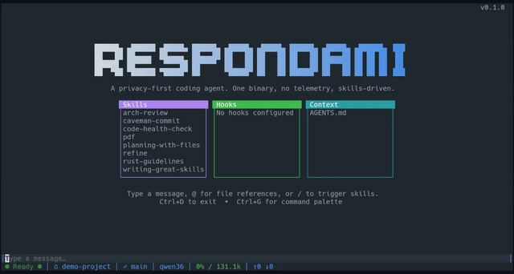

# Respondami

> **v0.1.0** — privacy-first coding agent. One binary, no telemetry, skills-driven.

Built with [Ratatui] and [Crossterm].

[Ratatui]: https://ratatui.rs
[Crossterm]: https://crossterm.rs



## ⚠️ No Permission System

Respondami has **no permission gates** — tool calls execute immediately without asking for approval. The agent has full autonomy to read, write, edit files, and run shell commands. **Run it inside a sandbox** (container, VM, or bubblewrap) to protect your system.

## Installation

### From Source

```bash
git clone https://github.com/sorcerersr/respondami.git
cd respondami
cargo build --release
```

The binary is at `target/release/respondami`.

### Prerequisites

- [Rust](https://rustup.rs/) (latest stable)
- [CMake](https://cmake.org/) (required for `aws-lc-sys`)
- A running LLM backend (e.g. [llama.cpp](https://github.com/ggerganov/llama.cpp) server)

## Quick Start

1. **Start your LLM server** (e.g. `llama-server -m model.gguf`)
2. **Run Respondami**: `./target/release/respondami`
3. **Configure**: On first run, Respondami creates `~/.config/respondami/config.json` with defaults. Edit it to point to your LLM server.
4. **Send a message**: Type in the input area and press `Enter`.

For a detailed walkthrough, see [docs/quick-start.md](./docs/quick-start.md).

## Features

- **Session management** — persist conversations as JSONL, resume across sessions
- **Automatic compaction** — LLM summarization keeps conversations within the context window
- **Skills** — self-contained capability packages (open standard, [agentskills.io](https://agentskills.io))
- **Hooks** — shell scripts at lifecycle points to inject context, block actions, or run side effects
- **RTK integration** — automatic command rewriting for safer shell execution
- **Project instructions** — `AGENTS.md` loaded into the system prompt on every turn

## Documentation

| Document                                     | Description                               |
| -------------------------------------------- | ----------------------------------------- |
| [Quick Start](./docs/quick-start.md)         | Getting started, key bindings, status bar |
| [Configuration](./docs/configuration.md)     | All config options, directory layout      |
| [Skills](./docs/skills.md)                   | Using and creating skills                 |
| [Hooks](./docs/hooks.md)                     | Lifecycle hooks, events, examples         |
| [Logging](./docs/logging.md)                 | Log file, debug levels, SSE debug capture |
| [Security](./docs/security.md)               | Threat model, sandboxing recommendations  |
| [Troubleshooting](./docs/troubleshooting.md) | Common issues and fixes                   |

## Development

```bash
cargo build --release            # build
cargo run                        # run the TUI
cargo clippy --all-targets --all-features   # must be clean (0 errors, 0 warnings)
cargo test                                    # all tests must pass
```

## License

Copyright (c) Stefan "Sorcerer" Rabmund

This project is licensed under the MIT license ([LICENSE] or <http://opensource.org/licenses/MIT>)

[LICENSE]: ./LICENSE
